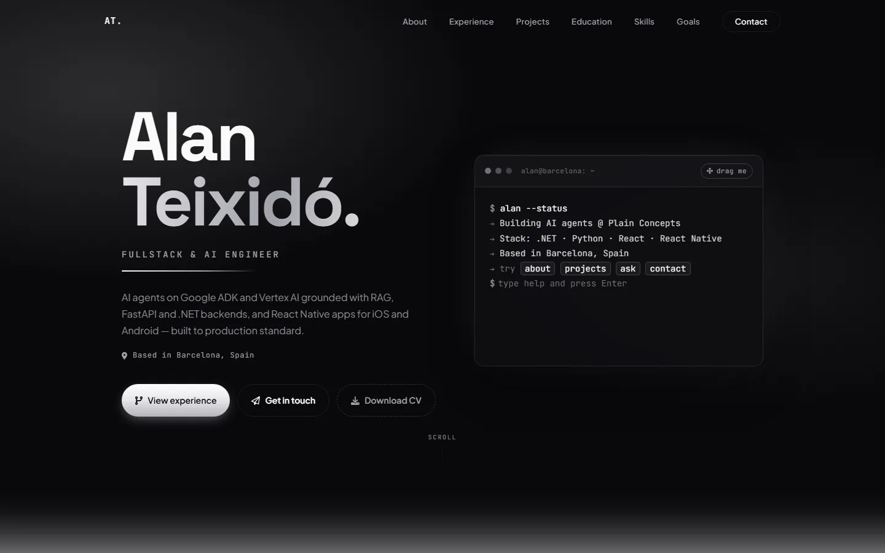
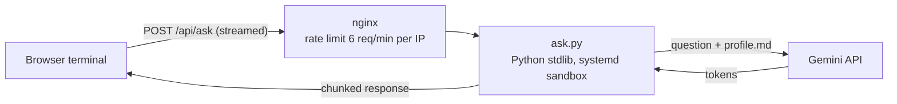

# alanteixido.dev

My CV as a website, with an AI assistant built into its terminal that answers questions about my experience. **Live at [alanteixido.dev](https://alanteixido.dev)**. Try `ask` in the terminal, or open [alanteixido.dev/#ask](https://alanteixido.dev/#ask).

<a href="https://alanteixido.dev"></a>

## What's in it

- **Interactive terminal**: commands such as `about`, `projects`, `stack` and `contact`, plus history, Tab completion and aliases. You can drag the window around the hero.
- **Ask my CV**: an assistant that answers only from [`api/profile.md`](api/profile.md), streamed token by token into the terminal. It works in any language the visitor writes in.
- **Monochrome design**: sections fade between light and dark themes as you scroll, with metallic text and scroll-driven animations. All of it stays still when `prefers-reduced-motion` is set.
- **Fast and accessible**: no framework and no build step. Fonts are self-hosted. Icons are generated as CSS masks, and every asset is cache-busted by content hash. Lighthouse scores: performance 96 on mobile and 100 on desktop, and 100 for accessibility, best practices and SEO.

## How Ask my CV works



- [`api/ask.py`](api/ask.py) is a small HTTP service written with only the Python standard library. It builds a prompt from `profile.md`, calls Gemini (`gemini-3.5-flash-lite`, free tier) and streams the answer back. It can also use Claude if an Anthropic key is configured.
- **Guardrails**:
  - questions are capped at 300 characters, and answers at 500 tokens;
  - each visitor gets 15 questions a day, with a 200-question total;
  - nginx applies per-IP rate limiting in front of the service;
  - the prompt tells the model to answer only about me and to decline anything else.
- **Isolation**: the service runs as a sandboxed systemd unit (`DynamicUser`, read-only filesystem) bound to localhost. The API key lives only in a root-owned environment file on the server.
- **Feature flag**: `GET /api/ask/health` reports whether an assistant is configured, and the terminal only offers `ask` when it is.

## Deploy and monitoring

- **Deploy**: every push to `main` deploys through [GitHub Actions](.github/workflows/main.yml) to a VPS running nginx. The deploy key can only run the deploy command, nothing else.
- **Monitoring**: a [daily workflow](.github/workflows/monitor.yml) checks that:
  - the pages and assets load;
  - the CV PDF is served;
  - the TLS certificate is more than 14 days from expiry;
  - the assistant answers a real question.

## Project layout

```
index.html, projects.html   pages
style.css, icons.css        styles (icons.css is generated)
main.js, terminal.js        site behaviour and the terminal
api/ask.py, api/profile.md  the assistant and its knowledge base
scripts/                    build-icons.js, stamp-assets.js (cache busting)
.githooks/pre-commit        re-stamps asset hashes on every commit
```

## Run it locally

```bash
python -m http.server 8000          # or: npx serve .
```

For the assistant you need a Gemini API key. Then run:

```bash
GEMINI_API_KEY=your-key python api/ask.py   # listens on 127.0.0.1:8787
```

Locally, the page and the API are served on different ports, so `/api/ask` needs a proxy in front of both, as nginx does in production. Without one, the terminal simply hides `ask`.

To refresh the asset hashes on every commit, enable the hook once per clone:

```bash
git config core.hooksPath .githooks
```

---

Built by [Alan Teixidó](https://alanteixido.dev), Software Engineer at Plain Concepts, Barcelona.
